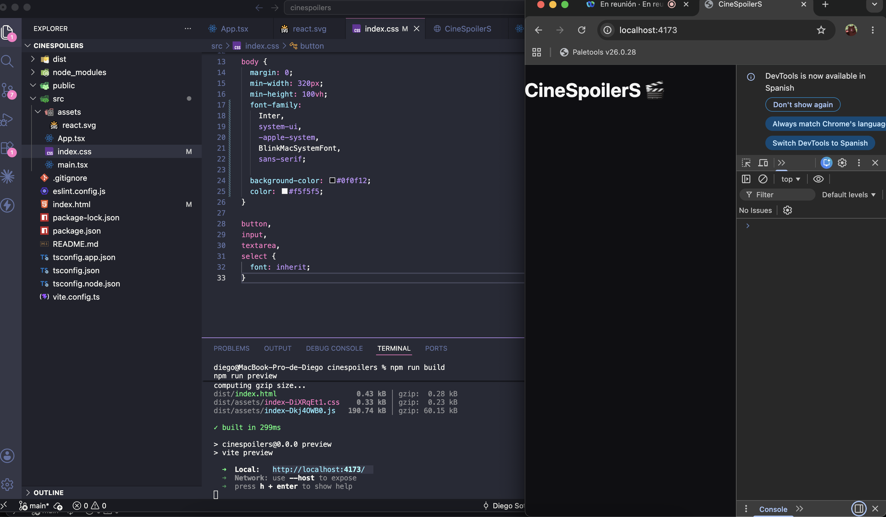

## DIEGO SOTELO

---

## Evidencia 1 - Proyecto Limpio, Renderizado y sin errores

## Evidencia 2 - Creación de componente con variables y uso

## Evidencia 3 - Props en el componente creado

## Evidencia 4 - Estado en el componente

## Evidencia 5 - Manejo de estado mediante eventos

